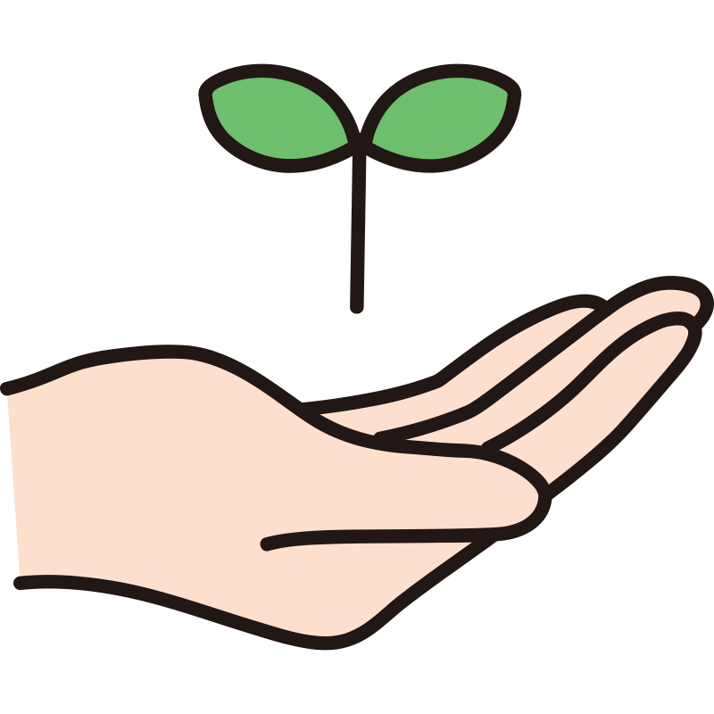

---
myst:
  html_meta:
    "description lang=en": |
      Top-level documentation for the science for the people project, with links to the rest of the site..
html_theme.sidebar_secondary.remove: true
---

```{toctree}
:maxdepth: 2
:hidden:

content/index
```

<!--Start of Tawk.to Script-->
<script type="text/javascript">
var Tawk_API=Tawk_API||{}, Tawk_LoadStart=new Date();
(function(){
var s1=document.createElement("script"),s0=document.getElementsByTagName("script")[0];
s1.async=true;
s1.src='https://embed.tawk.to/63da4028c2f1ac1e2030c5e3/1go68l7fv';
s1.charset='UTF-8';
s1.setAttribute('crossorigin','*');
s0.parentNode.insertBefore(s1,s0);
})();
</script>
<!--End of Tawk.to Script-->

# Science 2.

<div class="video-div">
<iframe  id="stickyAnchor" class="v-page-anchor float-left" src="https://www.youtube.com/embed/XKaY_N8puZc?enablejsapi=1" frameborder="0" fullscreen width="0" height="0" style="margin:auto;" allowfullscreen></iframe>
</div>
<script src="https://www.youtube.com/iframe_api"></script>
<script src='https://cdnjs.cloudflare.com/ajax/libs/jquery/3.1.0/jquery.min.js'></script><script  src="_static/assets/script/scriptvideo.js"></script>

::::{div} full-width

<br>
    
<div id="note">

<p class="emphase2"><strong>Interstellar Dust Grains, Ices &  Planet Formation</strong></p>
    
</div>

<br>

::::

<br>

:::::{div} full-width

::::{grid} 2

:::{grid-item}
:columns: 9

<p class="emphase2"><strong>Welcome</strong> &nbsp; 👋 </p>

```{epigraph}

You have just set foot on my <strong>accademic websites portefolio</strong>. They are the product of an innovative note taking method resulting in a free and creative way to share <strong>science</strong> while giving it an interactive and collaborative dimension. 
<br>Hope you enjoy !  


-- Vince (Creator, editor)

```

:::

:::{grid-item}
:columns: 3

<br>

<div class="stage" style="width: 100%; height:auto">
    <div class="cubespinner">
        <div class="face1">Be</div>
        <div class="face2">Curious</div>
        <div class="face3">Be</div>
        <div class="face4">Creative</div>
        <div class="face5">Be</div>
        <div class="face6">Confident</div>
    </div>
</div>


:::

::::

:::::

    
::::{margin} 


<div id="colour">
    
<p class="emphase"> <em>By</em>     
<br><br><strong>Vincent Deguin</strong> 
<br>
</p> 

***
    
 French (32 yo)

 PhD student

 The Open university, UK

 vincent.deguin@open.ac.uk

 [Vincent Deguin](https://www.researchgate.net/profile/Vincent-Deguin)

 [0000-0003-2280-8273](https://orcid.org/0000-0003-2280-8273)

 [Deugz](https://github.com/Deugz)

 [Deugz](https://codepen.io/deugz/)

 [Science By & For People](https://www.youtube.com/channel/UCfAsBZ1atxP-hyltfiCiM2w)
    
- Facebook
    
- Twitter
    
- Linkedin
    
</div>

::::


***

<br>

<p class="emphase2"><strong>Project Goals</strong> </p>


<p class="emphase"><strong>Online scientific publication and public engagement plateform</strong>, <br><span class="hovertext" data-hover="My own scientific journal"></span><br>
Self-own, creative, independant, interactive and lifelong, <br><span class="hovertext" data-hover="I am in control"></span><br>
Aimed at promoting collaboration between multi-disciplinary scientistist, <br><span class="hovertext" data-hover="And by-passing the classical publication system 🤫"></span><br> 
By providing the space and the tools To create and sustain an open and constructive dialogue<br><span class="hovertext" data-hover="Around trustworthy and peer reviewed pieces of research"></span><br>

:::::{div} full-width
    

<br>    

<p class="emphase2"><strong>5 websites</strong></p>

<br>   

::::{grid} 7
:class-container: text-center
:gutter: 3


:::{grid-item-card}
:class-header: bg-light
:link: "https://deugz.github.io/nb-master/_build/html/"
:columns: 2
**Master**
^^^

```{image} _static/Logo/logo_SFTP.png

```

+++


:::

:::{grid-item-card}
:class-header: bg-light
:link: "https://deugz.github.io/nb-phd/_build/html/"
:columns: 2
**Notes A**
^^^

```{image} _static/Logo/OU/SHIELD/SVG/OU_SHIELD_LOGO_BLUE_125mm.svg
:width: 80%
:align: center

```

+++


:::

:::{grid-item-card}
:class-header: bg-light
:link: "https://deugz.github.io/nb-museum/_build/html/"
:columns: 2
**Notes B**
^^^

```{image} _static/Logo/OU/SHIELD/SVG/OU_SHIELD_LOGO_BLUE_125mm.svg
:width: 80%
:align: center
```

+++


:::

:::{grid-item-card}
:class-header: bg-light
:link: "https://deugz.github.io/nb-thesis/_build/html/"
:columns: 2
**Thesis**
^^^

```{image} _static/Logo/OU/SHIELD/SVG/OU_SHIELD_LOGO_BLUE_125mm.svg
:width: 80%
:align: center
```

+++


:::


:::{grid-item-card}
:class-header: bg-light
:link: "https://deugz.github.io/nb-teaching/_build/html/"
:columns: 2
**School 2.A**
^^^

```{image} _static/Logo/logo_SFTP.png

```

+++


:::

:::{grid-item-card}
:class-header: bg-light
:link: "https://deugz.github.io/nb-odapa/_build/html/"
:columns: 2
**ODAPA**
^^^

```{image} _static/Logo/ODAPA/master-logo-open-dialogues-open.svg

```

+++


:::

::::

<br>
<br>

<p class="emphase"><strong>Current State</strong> </p>

<br>


***  
    
 - <span class="hovertext" data-hover="I am trying to experiment with how research can be made interactive and entertaining for the general public (within which I count all researchers) ">Experiment</span> &nbsp;&nbsp;&nbsp;&nbsp;  - <span class="hovertext" data-hover="I intend to use this plateform over the whole length of my scientific career so bear with me">Work in progress</span> &nbsp;&nbsp;&nbsp;&nbsp;  - <span class="hovertext" data-hover="Lifelong">a Journey</span> &nbsp;&nbsp;&nbsp;&nbsp;  - <span class="hovertext" data-hover="I would love to get contributions from as many researchers (and not only). Could be a freelance scientific journalist">Participative</span> &nbsp;&nbsp;&nbsp;&nbsp;  - <span class="hovertext" data-hover="This content is to be read like a book (not necessarily pages by pages in order)">Online Free Book</span>


    
:::::


***

<div class="video-div">
<iframe  id="stickyAnchor" class="v-page-anchor float-left" src="https://www.youtube.com/embed/ZC488_LS42o?enablejsapi=1" frameborder="0" fullscreen width="0" height="0" style="margin:auto;"></iframe>
</div>
<script src="https://www.youtube.com/iframe_api"></script>
<script src='https://cdnjs.cloudflare.com/ajax/libs/jquery/3.1.0/jquery.min.js'></script><script  src="_static/assets/script/scriptvideo.js"></script>

:::::{div} full-width

<br>

<p class="emphase2"><strong>Master</strong> </p>

<br>

::::{grid} 1 1 2 5
:class-container: text-center
:gutter: 3

:::{grid-item-card}
:class-header: bg-light
:link: Profile/Interests.html
<span style="float: right"></span>  **Profile** 
^^^

- Scientific Interests

- CV


:::

:::{grid-item-card}
:class-header: bg-light
:link: Projects/Roadmap.html
<span style="float: right"></span>  **Project** 
^^^

*Science for the people*, project description

:::

:::{grid-item-card}
:class-header: bg-light
:link: Research/Research_Main.html
<span style="float: right"></span>  **Research** 
^^^

My research outputs, classified by projects. 

:::
:::{grid-item-card}
:class-header: bg-light
:link: Teaching/Teaching_main.html
<span style="float: right">&#128640;</span> **Teaching** 
^^^

Teaching material and collaborative space.

:::

:::{grid-item-card}
:class-header: bg-light
:link: Blog/Blog_Main.html
<span style="float: right">&#128165;</span> **Blog** 
^^^

Because why not ?

:::
::::
:::::

<br>


## **Science By & For People** 

:::::{div} full-width

<br>
<br>

<p class="emphase2"> <strong>New tools and methods </strong></p>

<p class="emphase"> to perform, edit, publish, share and discuss <strong>Research</strong> 📖</p>

<br>

::::{grid} 4
:::{grid-item-card}
:class-header: bg-light 
<span style="float: right"></span> **Manifesto**  
^^^

<span class="hovertext" data-hover="What are the issues I am trying to solve and what are the values I defend">Why !</span>

+++

[Learn more](Projects/Manifesto)

:::

:::{grid-item-card}
:class-header: bg-light
<span style="float: right"></span> **Guides** 
^^^

<span class="hovertext" data-hover="How do I (and potentially you) use online books and how you can interact with them">How !</span>


+++

[Learn more](Projects/How_do/How_main)

:::

:::{grid-item-card}
:class-header: bg-light
<span style="float: right"></span>
**Roadmap**
^^^

<span class="hovertext" data-hover="What I am aiming to achieve with this project, and at what stage we are at.">When !</span>

+++

[Learn more](Projects/Roadmap)

:::
:::{grid-item-card}
:class-header: bg-light
<span style="float: right"></span> **Contribute**
^^^

<span class="hovertext" data-hover="Everybody really so come and help">w/ Who ?</span>

+++

[Learn more](Projects/Contribute)


:::

::::
:::::


:::::{div} full-width

<br>
<br>

<p class="emphase2"><strong>Free & Open Source </strong></p>

<p class="emphase">Not free of effort though 💪</p>

::::{grid} 3
:::{grid-item}
:columns: 6 


```{admonition} Jupyter Book
:class: tip

This web-site have been built from a collection of `markdown` files, transformed in `html` using:

<p class="emphase"><a href="https://jupyterbook.org/en/stable/intro.html" target="_blank">Jupyter Book</a></p>


**Accessible to everyone**.


- Open
- Free
- Easy to use

<br>

```

:::

:::{grid-item-card}
:columns: 3
:margin: 4 4 0 0
:class-header: bg-light
How I use this book <span style="float: right">🙃</span> 
^^^

- [Notebook](content:references:How_do_I_Title1)
- [Edition](content:references:How_do_I_Title2)
- [Storage](content:references:How_do_I_Title3)
- [Open Science](content:references:How_do_I_Title4)
- [Communication](content:references:How_do_I_Title5)
- [Collaboration](content:references:How_do_I_Title6)
- [Publications](content:references:How_do_I_Title7)
- [Engagement](content:references:How_do_I_Title8)
- [Management](content:references:How_do_I_Title9)
- [Social media](content:references:How_do_I_Title10)

+++

[Learn more](Projects/How_do/How_do_I)

:::

:::{grid-item-card}
:columns: 3
:margin: 4 4 0 0
:class-header: bg-light
<span style="float: right"></span> How **You** can use it
^^^

- [Who are you](content:references:How_can_you_Title1)   
- [Interact](content:references:How_can_you_Title2)
    - [Collaborate](content:references:How_can_you_Title2.1)
    - [Review](content:references:How_can_you_Title2.2)
    - [Comment](content:references:How_can_you_Title2.3)
    - [Discuss](content:references:How_can_you_Title2.4)
    - [Chat](content:references:How_can_you_Title2.5)


+++

[Learn more](Projects/How_do/How_can_you)

:::
::::

:::::


<br>
<br>

:::::{div} full-width

::::{grid} 2

:::{grid-item}
:columns: 8 

<br>

<p class="emphase"> Want your own accademic web-site?</p>

<br>

<p class="emphase2"> <strong> Get in touch! </strong> </p>

```{admonition} Help
:class: warning


And if you are an expert in any of those topics, feel free to come and help me too  

```


:::


:::{grid-item}
:columns: 4 


<h4>I can <strong>Help</strong> &nbsp; 😉</h4>

- [Open Science Tools](Appendix/Help/OpenScience/Open_Science)
- [Markdown](Appendix/Help/Markdown/Markdown)
- [Executable Books](Appendix/Help/Executable-Book/Executable-Book)
    - [Jupyter Book](Appendix/Help/Executable-Book/Jupyter)
    - [MyST](Appendix/Help/Executable-Book/MyST)
- [Anaconda](Appendix/Help/Anaconda/Anaconda_JB)
- [Github](Appendix/Help/Github/Github_JB)
- [Binder](Appendix/Help/Binder/Binder_JB)
- [Semantic Web](Appendix/Help/SemanticWeb/SemanticWeb)

:::

::::

:::::


## **Research**

<br>
<br>

:::::{div} full-width

<p class="emphase2"><strong>My Scientific Projects</strong></p>

<br>
<br>


::::{card-carousel} 2

:::{card} 
:class-header: bg-light
**Stairway to Heaven**
^^^

*Experimenting with the earliest stages of planet formation* (Part 2)


- Job Type: PhD
- Lead supervisor: Anita Dawes
- Discipline: Astrochemistry
- Duration: 4.5 years
- Status:  &#x2192; 

+++
&#128064; &#x2192; [](https://deugz.github.io/nb-phd/_build/html/)
:::

:::{card}
:class-header: bg-light
**Museum of non result**
^^^

*Experimenting with the earliest stages of planet formation* (Part 1)

- Job Type: PhD
- Lead supervisor: Helen Fraser
- Discipline: Astrophysics / Engeneering / Material Sciences
- Duration: 4.5 years
- Status:  &#x2192; 


+++
&#128064; &#x2192; [](https://deugz.github.io/nb-museum/_build/html/)
:::

:::{card}
:class-header: bg-light
**First steps**
^^^

*Photochemistry of Fe:H<sub>2</sub>O adducts in argon matrixes: a combined experimental and theoretical study in the mid-ir and uv-visible regions*

- Job Type: Internship
- Lead supervisor: Jennifer Noble
- Discipline: Astrochemistry
- Duration: 2 month
- Status: Finished (&#9989;)

<br>
<br>


- [](https://doi.org/10.1021/acs.jpca.7b09681) - []()


+++


**Scientific publication**  &#x2192; {cite}`Deguin2018`
:::

:::{card}
:class-header: bg-light
**Condor Project**
^^^

Sprinkle a lot of this {cite}`Hague2020` on top of that {cite}`Souza2017` and you get a pretty cool project:  

*3D tissue modelling with the CONDOR (link) model* 


- Job Type: Research Associate (Postdoc)
- Discipline: Computer Sciences / Biologie
- Duration: 2 month


+++


&#x26D4; - **commercial application**
:::

::::
:::::

<br>
<br>


:::::{div} full-width


<p class="emphase2"><strong>Collaborative</strong> </p>

<br>

<p class="emphase"> Tools to interact with the page</p>

<br>


::::{grid} 1 1 2 5
:class-container: text-center
:gutter: 3


:::{grid-item-card}
:class-header: bg-light
**Interact**

^^^
Interact and play with the code

+++
 Binder

:::

:::{grid-item-card}
:class-header: bg-light

**Annotate**

^^^
Annotate every word in this web-site.
+++
 Hypothesis
:::

:::{grid-item-card}
:class-header: bg-light

**Reproduce**

^^^

`Github`, `Figshare`
Code and data repositories.

+++
 Github / Figshare
:::


:::{grid-item-card}
:class-header: bg-light
**Comment**
^^^
`Utterances` (needs login - Github account) is a space at the bottom of each page for more relax comments.

+++
 Utterance
:::


:::{grid-item-card}
:class-header: bg-light
**Chat / Forum**
^^^

+++
 Futur
:::

::::
:::::

<br>


:::::{div} full-width


```{image} _static/Images/splitting-research.png
:width: 100%

```

<br>
<br>

::::{grid} 3

:::{grid-item}

```{admonition} Peer-Review 
:class: warning, dropdown
Every word I am writing is to be reviewed, questionned, challenged ... Help yourself with all the aformentionned tools and if you are not sure about how to use it, check the following page:

- [Help/Tools](Appendix/Help/Tools.html)

```

:::

:::{grid-item}

```{admonition} Colaborate 
:class: seealso, dropdown


I would like to welcome as many contributions as possible from a wide variety of researchers to explain the basics of their disciplines (in a completely free and creative fashion).

```

:::

:::{grid-item}

```{admonition} Discuss 
:class: tip, dropdown
Process the data using my online tools ... 

```

:::


::::

<br>

<p class="emphase">All we need to create and sustain an ... </p>

<br>

<p class="emphase2"><strong>Open Dialogue</strong> 😁 </p>

<br>


:::::

<br>

## **Teaching**

:::::::{div} full-width

<br>

<p class="emphase2"> <strong>Cutting Edge Science </strong></p>


<p class="emphase"> From multiple disciplines </p>

<br>

::::::{grid} 2

:::::{grid-item}
:columns: 8

::::{grid} 1 1 2 5
:class-container: text-center
:gutter: 2

:::{grid-item}
:columns: 1


:::

:::{grid-item-card}
:class-header: bg-light
:link: https://deugz.github.io/nb-teaching/_build/html/Bitesize/Astronomy/Astronomy_Main.html
:columns: 3
**Astronomy**
^^^

```{image} _static/SVG_files/Disciplines/galaxy-svgrepo-com.svg

```

:::

:::{grid-item-card}
:class-header: bg-light
:link: https://deugz.github.io/nb-teaching/_build/html/Bitesize/Physics/Physics_Main.html
:columns: 3
**Physics**
^^^

```{image} _static/SVG_files/Disciplines/atoms-physics-svgrepo-com.svg

```

:::

:::{grid-item-card}
:class-header: bg-light
:link: https://deugz.github.io/nb-teaching/_build/html/Bitesize/Chemistry/Chemistry_Main.html
:columns: 3
**Chemistry**
^^^

```{image} _static/SVG_files/Disciplines/chemistry-svgrepo-com.svg

```

:::

:::{grid-item}
:columns: 2


:::

:::{grid-item}
:columns: 1


:::

:::{grid-item-card}
:class-header: bg-light
:link: https://deugz.github.io/nb-teaching/_build/html/Practicle/WebDev/WebDev_Main.html
:columns: 3
**Web Dev**
^^^

```{image} _static/SVG_files/Disciplines/hand-holding-globe-svgrepo-com.svg

```

:::

:::{grid-item-card}
:class-header: bg-light
:link: https://deugz.github.io/nb-teaching/_build/html/Practicle/Python/Python_Main.html
:columns: 3
**Python**
^^^

```{image} _static/SVG_files/Disciplines/python-svgrepo-com.svg

```

:::

:::{grid-item-card}
:class-header: bg-light
:columns: 3
**More ...**
^^^

```{image} _static/SVG_files/Disciplines/infinity-symbol-svgrepo-com.svg

```


:::

:::{grid-item}
:columns: 2


:::

::::

:::::

:::::{grid-item}
:columns: 4

<div class="book"></div>

:::::
    
::::::

:::::::


:::::::{div} full-width

<br>

<p class="emphase2"><strong> Fun and Creative</strong></p>

<p class="emphase">Organised by <span class="hovertext" data-hover="And not within a rigid curriculum">Topics</span> </p>

<br>

::::::{grid} 2

:::::{grid-item}
:columns: 4

<h4><strong>Astronomy</strong></h4>

::::{grid-item-card}
:class-header: bg-light

**Topics**
^^^

<br>


- [**Astronomy 101**](https://deugz.github.io/nb-teaching/_build/html/Bitesize/Astronomy/Astronomy_101/Astronomy_101.html)  &#x2192; &#128064; 

<br>


- [The Solar System](https://deugz.github.io/nb-teaching/_build/html/Bitesize/Astronomy/The_solar_system/Solar_system.html)


- [Stars Lifecycle](https://deugz.github.io/nb-teaching/_build/html/Bitesize/Astronomy/JWST/JWST.html)


- [The Interstellar Medium](https://deugz.github.io/nb-teaching/_build/html/Bitesize/Astronomy/JWST/JWST.html) 


- [Astrochemistry](https://deugz.github.io/nb-teaching/_build/html/Bitesize/Astronomy/JWST/JWST.html)


- [Interstellar Dust](https://deugz.github.io/nb-teaching/_build/html/Bitesize/Astronomy/JWST/JWST.html)


- [Planet formation](https://deugz.github.io/nb-teaching/_build/html/Bitesize/Astronomy/JWST/JWST.html)


- [Planet formation II](https://deugz.github.io/nb-teaching/_build/html/Bitesize/Astronomy/JWST/JWST.html)


- [Excoplanets](https://deugz.github.io/nb-teaching/_build/html/Practicle/Python/Python_Main.html)


- [JWST](https://deugz.github.io/nb-teaching/_build/html/Bitesize/Astronomy/JWST/JWST.html) 
    
::::
    
:::::

:::::{grid-item}
:columns: 8

:::{div} center-text

<h4> <strong>Astronomy 101</strong></h4>

:::


<p class="emphase">Different difficulty levels (🟢 - 🟡 - 🔴 - 🟣) <br> Continuous integration & improvement from real feedbacks <br> Inputs from multiple and diverse scientific actors</p>

<br>

::::{card-carousel} 2

:::{grid-item-card}
:class-header: bg-light
:link: https://deugz.github.io/nb-teaching/_build/html/Bitesize/Astronomy/Astronomy_101/Astronomy_101.html
:columns: 4
:margin: 3
**Introduction**
^^^

- **Difficulty**: 🟢 
- **Status**:  - 🔥
- **Needs**: 🏸 - 💏
- **Read time**: 5 min


:::

:::{grid-item-card}
:class-header: bg-light
:link: https://deugz.github.io/nb-teaching/_build/html/Bitesize/Astronomy/Astronomy_101/Sub_topics/Cosmic_inventory.html
:columns: 4
:margin: 3
**Cosmic Inventory**
^^^

- **Difficulty**: 🟡 
- **Status**:  - 🔥
- **Needs**: 🏸 - 💏
- **Read time**: 5 min


:::


:::{grid-item-card}
:class-header: bg-light
:link: https://deugz.github.io/nb-teaching/_build/html/Bitesize/Astronomy/Astronomy_101/Sub_topics/History.html
:columns: 4
:margin: 3
**Historical Perspective**
^^^

- **Difficulty**: 🔴 
- **Status**:  - 🔥
- **Needs**: 🏸 - 💏
- **Read time**: 1h


:::

:::{grid-item-card}
:class-header: bg-light
:link: https://deugz.github.io/nb-teaching/_build/html/Bitesize/Astronomy/Astronomy_101/Sub_topics/Telescope_anat.html
:columns: 4
:margin: 3
**Anatomy of a telescope**
^^^

- **Difficulty**: 🟣 
- **Status**:  - 🔥
- **Needs**: 🏸 - 💏
- **Read time**: 5 min

:::


:::{grid-item-card}
:class-header: bg-light
:link: https://deugz.github.io/nb-teaching/_build/html/Bitesize/Astronomy/Astronomy_101/Sub_topics/Missions.html
:columns: 4
:margin: 3
**Space Missions**
^^^

- **Difficulty**: 🟡 
- **Status**:  - 🔥
- **Needs**: 🏸 - 💏
- **Read time**: 20 min

:::

:::{grid-item-card}
:class-header: bg-light
:link: https://deugz.github.io/nb-teaching/_build/html/Bitesize/Astronomy/Astronomy_101/Sub_topics/Exploration.html
:columns: 4
:margin: 3
**Space Exploration**
^^^

- **Difficulty**: 🟡 
- **Status**:  - 🔥
- **Needs**: 🏸 - 💏
- **Read time**: 20 min

:::

::::

:::::

::::::

:::::::


:::::{div} full-width

<br>
<br>

<p class="emphase2"><strong>  3 Formats  </strong></p>

<p class="emphase"><strong> <span class="hovertext" data-hover="Fuck off with your deadlines !! 🤭">Lifelong</span></strong> implementation  </p>

<br>

::::{grid} 3

:::{grid-item-card}
:class-header: bg-light
:columns: 4

**Bitesize** <span style="float: right"></span>
^^^

Small lessons to introduce specific topics that I encounter during my research journey. Overview of the various concepts relative to a scientific topics. 


:::  

:::{grid-item-card}
:class-header: bg-light
:columns: 4

**Practicle** <span style="float: right"></span>
^^^

Some practical tutorials which will accompanied you in producing some material.

:::

:::{grid-item-card}
:class-header: bg-light
:columns: 4

**Cours particuliers** <span style="float: right"></span>

^^^


:::

::::

<br>
<br>


<p class="emphase"> Let's go ? </p>

:::{div} center-text

[](https://deugz.github.io/nb-teaching/_build/html/) 

:::


</p>


:::::


## **Blog**

::::{margin}

```{admonition} Opinions
:class: warning

Only my personal opinions are expressed in the following posts and they don't reflect the positions of my University or any related bodies or persons.

```

::::

<br>

::::{grid} 2

:::{grid-item-card}
:class-header: bg-light
:columns: 6

**Blog**
^^^

- [Scientific Publication](https://deugz.github.io/nb-master/_build/html/Blog/Posts/Scientific_Publication.html)
- [Hackaton](https://deugz.github.io/nb-master/_build/html/Blog/Posts/Annie_woman.html) 
- [ODAPA](https://deugz.github.io/nb-master/_build/html/Blog/Posts/ODAPA.html) 

:::  

:::{grid-item-card}
:class-header: bg-light
:columns: 6

**Versions**
^^^

- [version 0](https://deugz.github.io/nb-master/_build/html/Blog/Version/version0.html) - 
- [version 1](https://deugz.github.io/nb-master/_build/html/Blog/Version/version1.html)


:::
::::


# Comments


:::::::{div} full-width

::::::{grid} 3

:::::{grid-item-card}
:class-header: bg-light
:columns: 5

**Notes**
^^^

<br>

<blockquote class="trello-card"> 
  <a href="https://trello.com/c/WTiMvieA/3-intromd">Trello Card</a>
</blockquote>
<script src="https://p.trellocdn.com/embed.min.js"></script>


:::::


:::::{grid-item-card}
:class-header: bg-light
:columns: 4
**Page**
^^^

<br>

- Author:  Vincent Deguin;
- Status:  &#9989; <span class="hovertext" data-hover="To be Reviewed">🔎</span>
- Reviewed: <span class="hovertext" data-hover="Insert here who has done what">&#x274C;</span>
- Updated: 28/05/2023


   
:::::

:::::{grid-item-card}
:class-header: bg-light
:columns: 3
<span style="float: right"></span>**Help** 
^^^

<br>

<script type='text/javascript' src='https://storage.ko-fi.com/cdn/widget/Widget_2.js'></script><script type='text/javascript'>kofiwidget2.init('Buy me a coffee', '#317315', 'O4O6EZO78');kofiwidget2.draw();</script> 

<br>
<br>

or

<br>

 [Patreon](https://www.patreon.com/Science_for_the_People) 

:::::
::::::
:::::::


***

::::{div} full-width

-  -  -  -  -  - 
      
::::


***

<script src="https://utteranc.es/client.js"
        repo="Deugz/nb-master"
        issue-term="pathname"
        theme="github-light"
        crossorigin="anonymous"
        async>
</script>


